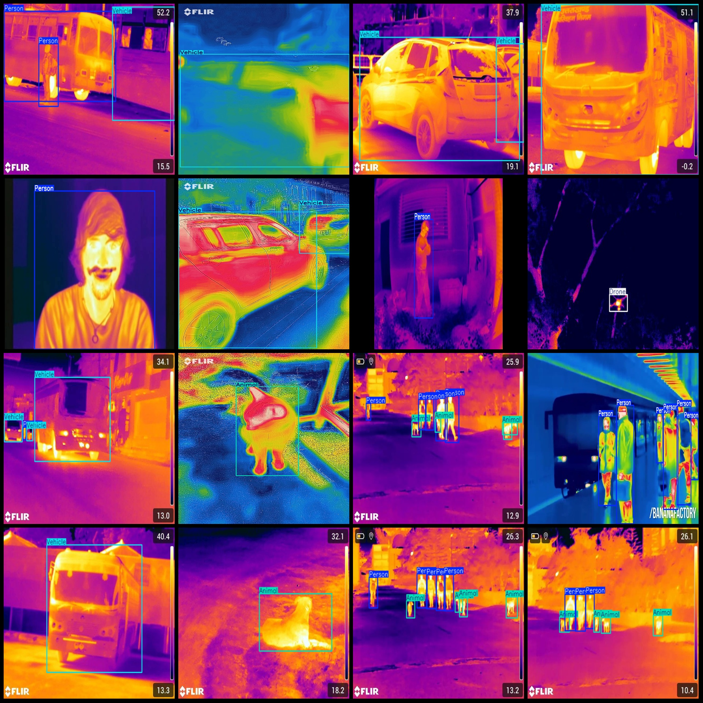
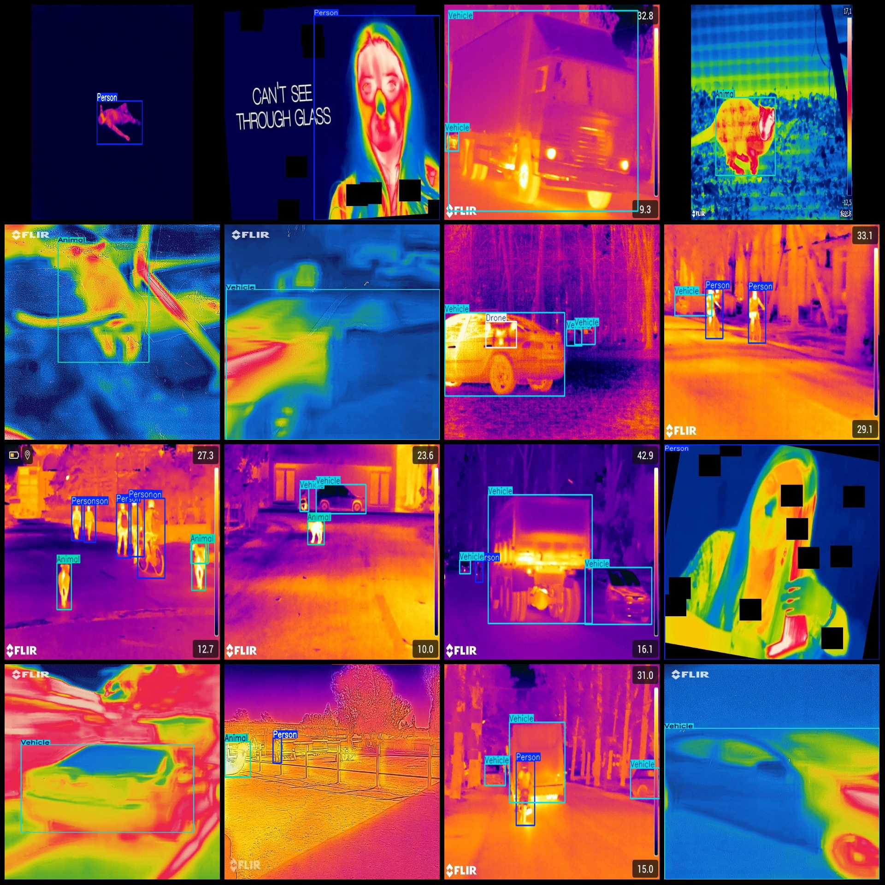

# Infrared Thermal Imaging Human Drone Vehicle Animal Detection Dataset VOC+YOLO Format with 2181 Images, 4 Categories

Dataset format: Pascal VOC format + YOLO format (txt file without split path, only containing jpg images and corresponding VOC format xml files and yolo format txt files)
Number of images (jpg file count): 2181
Number of annotations (xml file count): 2181
Number of annotations (txt file count): 2181
Number of categories: 4
Annotation category names (note that the order in yolo format is different from this, and should be aligned with the "labels" folder's "classes.txt"): ["Animal", "Drone", "Person", "Vehicle"]
Number of bounding boxes per category:
- Animal (animals) = 1294
- Drone (drones) = 142
- Person (people) = 2142
- Vehicle (vehicles) = 1080
Total bounding boxes: 4658
Number of images per category:
- Animal (animals) = 709
- Drone (drones) = 142
- Person (people) = 1163
- Vehicle (vehicles) = 696
Image resolution: Multi-resolution images, such as 640x480, 640x640, etc.
Annotation tool used: labelImg
Annotation rules: Draw bounding boxes for each category
Important note: The dataset does not have a separate training/validation/test split, and must be divided by the user.
Special declaration: This dataset does not guarantee any accuracy of models or weight files trained on it.
Image preview:
Annotation example:

## Images

Here is a pay link on Stripe ( https://buy.stripe.com/3cs8yP7sY87d0vu9AB ). Please contact me lonlonago@foxmail.com after funding $89, and I will send you a complete data files , thank you!

